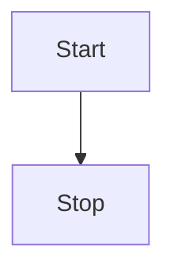
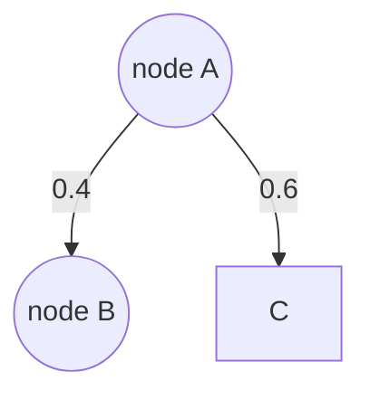

https://mermaid.js.org/syntax/flowchart.html


```mermaid
flowchart LR
A[node A] --> B[node B]
B --> C{node C}
C -->|One| D[node D]
C -->|Two| E[node E]

````

```mermaid
%%{init: {"flowchart": {"htmlLabels": false}} }%%
flowchart LR
    markdown["`This **is** _Markdown_`"]
    newLines["`Line1
    Line 2
    Line 3`"]
    markdown --> newLines

```






